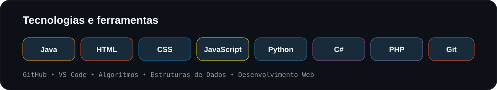

### Olá! Eu sou Jean Carlos 👋

**Estudante de Sistemas de Informação • Desenvolvedor em formação**

[GitHub](https://github.com/jeanxn0) • [LinkedIn](https://www.linkedin.com/in/jean-carlos-50076835a)

## 👨‍💻 Sobre mim

Sou **Jean Carlos Santos**, estudante do **4º período de Sistemas de Informação** no **IFSULDEMINAS — Campus Machado**.

- 📍 Machado, Minas Gerais, Brasil
- 💻 Interesse em desenvolvimento de software, web e banco de dados
- ☕ Projetos com Java, algoritmos e estruturas de dados
- 🌐 Interfaces com HTML, CSS e JavaScript
- 🎯 Em busca de estágio ou oportunidade inicial em TI
- 📚 Português nativo e inglês básico

## 🛠️ Tech Stack

## 🚀 Projetos em destaque

<table>
<tr>
<td width="50%">

</td>
<td width="50%">

</td>
</tr>
<tr>
<td width="50%">

</td>
<td width="50%">

</td>
</tr>
</table>

## 📈 Minha evolução

- Confira meus [repositórios públicos](https://github.com/jeanxn0?tab=repositories)
- Veja meu [histórico de contribuições](https://github.com/jeanxn0)
- Acompanhe os projetos que estou desenvolvendo e aprimorando

## 🎯 Missão atual

> Transformar conhecimento em projetos reais, melhorar a cada commit e construir uma carreira sólida em tecnologia.

